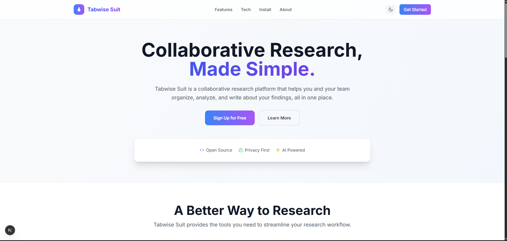
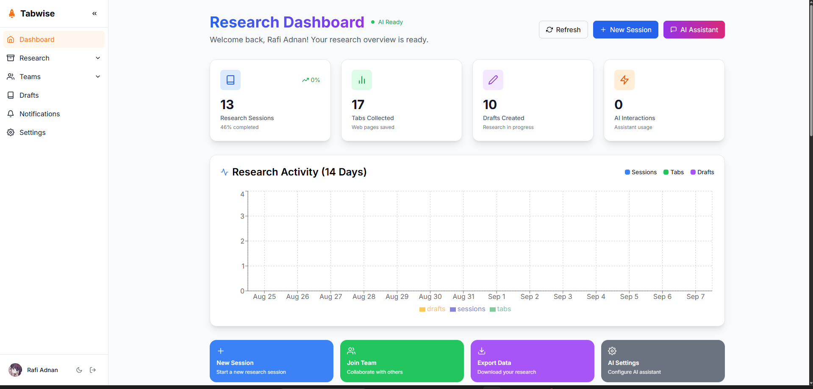
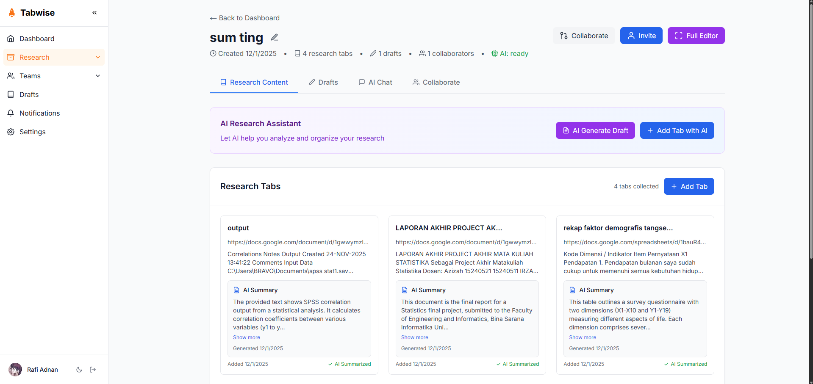
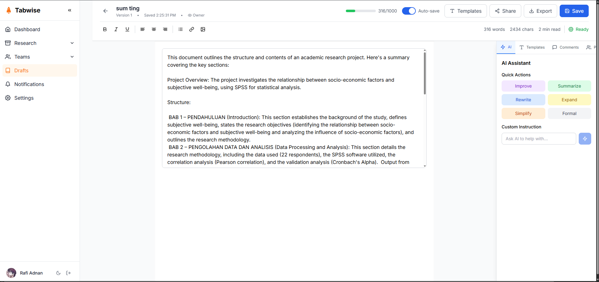

# Concentra — Collaborative Research Platform

> **Concentra** (formerly Tabwise) is a collaborative research platform that helps you and your team organize, analyze, and write about your findings, all in one place. Built with Next.js, Supabase, and Google Gemini AI.

---

## Table of Contents

- [Key Features](#key-features)
- [Screenshots](#screenshots)
- [Tech Stack](#tech-stack)
- [Architecture](#architecture)
- [Database Schema (ERD)](#database-schema-erd)
- [Pages & Functionality](#pages--functionality)
- [Getting Started](#getting-started)
- [Browser Extension](#browser-extension)
- [Security](#security)
- [Known Limitations](#known-limitations)
- [CI/CD Pipeline](#cicd-pipeline)
- [License](#license)
- [Support](#support)

---

## Key Features

### Research & Collaboration
- **Collaborative Research Sessions** — Create shared research sessions with your team, keeping all resources in one place
- **AI-Powered Insights** — Automatically summarize articles, get key insights, and generate citations with built-in AI (Google Gemini)
- **Collaborative Drafting** — Write, edit, and comment on research drafts with your team in real-time
- **Real-time Collaboration** — See who's online and what they're working on via Supabase Realtime
- **Team Management** — Organize your team, manage members, and control access to research sessions
- **Notifications** — Stay up-to-date with the latest activity in your research sessions

### User Experience
- **Dark/Light Mode** — Choose your preferred theme, automatically syncs with system preference
- **Export Your Work** — Export research sessions and drafts to various formats for sharing and archiving
- **Browser Extension** — Collect tabs and resources directly from Chrome

---

## Screenshots

| Dashboard | Research Session | Collaborative Editor | Team Management |
|-----------|------------------|---------------------|-----------------|
|  |  |  |  |

---

## Tech Stack

| Layer | Technology | Purpose |
|-------|------------|---------|
| **Framework** | Next.js 15 (App Router) | React framework with SSR/RSC |
| **Styling** | Tailwind CSS | Utility-first CSS |
| **Database** | Supabase (PostgreSQL) | Relational DB with realtime |
| **Authentication** | Supabase Auth | Email/password, OAuth, magic links |
| **AI** | Google Gemini | Article summarization, insights |
| **Realtime** | Supabase Realtime | Live collaboration, presence |
| **Language** | TypeScript | Type safety |

---

## Architecture

```
eyaya/
├── src/
│   ├── app/                    # Next.js App Router pages
│   │   ├── (auth)/            # Auth pages (sign-in, sign-up, reset-password)
│   │   ├── (dashboard)/       # Protected dashboard routes
│   │   │   ├── dashboard/     # User dashboard
│   │   │   ├── drafts/        # Draft management
│   │   │   ├── research/      # Research sessions
│   │   │   ├── session/[id]/  # Collaboration workspace
│   │   │   ├── ai/research/   # AI-powered research
│   │   │   ├── team/          # Team management
│   │   │   ├── notifications/ # Notification feed
│   │   │   ├── profile/       # User profile
│   │   │   └── settings/      # User preferences
│   │   ├── api/               # API routes
│   │   └── layout.tsx         # Root layout with providers
│   ├── components/            # Reusable UI components
│   │   ├── ui/               # Base UI components (shadcn/ui style)
│   │   ├── editor/           # Collaborative editor components
│   │   ├── research/         # Research-specific components
│   │   └── team/             # Team management components
│   ├── lib/                   # Core utilities
│   │   ├── supabase/         # Supabase client (browser & server)
│   │   ├── ai/               # Google Gemini integration
│   │   ├── utils.ts          # Helper functions
│   │   └── validations.ts    # Zod schemas
│   ├── hooks/                 # Custom React hooks
│   │   ├── useRealtime.ts    # Supabase Realtime subscriptions
│   │   ├── useAuth.ts        # Auth state management
│   │   └── usePresence.ts    # User presence tracking
│   ├── types/                 # TypeScript type definitions
│   └── middleware.ts          # Auth middleware, route protection
├── public/                    # Static assets
├── supabase/                  # Supabase configuration
│   ├── migrations/           # Database migrations
│   └── seed.sql             # Seed data
└── package.json
```

### Data Flow

```
User Action → Next.js Server Component → Supabase (PostgreSQL)
                                     ↓
                             Supabase Realtime → Connected Clients
                                     ↓
                             Google Gemini API → AI Insights
```

---

## Database Schema (ERD)

See [ERD.md](ERD.md) for the complete Entity Relationship Diagram with Mermaid visualization.

### Core Entities
| Table | Primary Key | Foreign Keys | Description |
|-------|-------------|--------------|-------------|
| `profiles` | `id` (uuid) | References `auth.users.id` | User profiles with settings |
| `settings` | `id` (uuid) | `user_id` → `profiles.id` | User preferences |
| `research_sessions` | `id` (uuid) | `user_id`, `team_id` | Research project containers |
| `drafts` | `id` (uuid) | `session_id`, `user_id` | Collaborative documents |
| `tabs` | `id` (uuid) | `session_id`, `user_id` | Collected research sources |
| `session_collaborators` | `id` (uuid) | `session_id`, `user_id` | Real-time collaboration |
| `session_messages` | `id` (uuid) | `session_id`, `user_id` | Chat messages (user/AI) |
| `summaries` | `id` (uuid) | `tab_id` | AI-generated summaries |
| `comments` | `id` (uuid) | `draft_id`, `user_id` | Draft comments |

### Team & Organization
| Table | Primary Key | Foreign Keys | Description |
|-------|-------------|--------------|-------------|
| `teams` | `id` (uuid) | `owner_id` → `profiles.id` | Team workspaces |
| `team_members` | `id` (uuid) | `team_id`, `user_id` | Team membership with roles |
| `team_messages` | `id` (uuid) | `team_id`, `user_id` | Team chat |

### AI & Analytics
| Table | Primary Key | Foreign Keys | Description |
|-------|-------------|--------------|-------------|
| `ai_providers` | `id` (uuid) | - | AI service providers (Gemini, OpenAI, etc.) |
| `ai_models` | `id` (uuid) | `provider_id` | Specific models per provider |
| `ai_prompts` | `id` (uuid) | `user_id` | User prompts |
| `ai_prompt_responses` | `id` (uuid) | `prompt_id`, `provider_id`, `model_id` | AI responses |
| `ai_response_feedback` | `id` (uuid) | `response_id`, `user_id` | Quality ratings |
| `ai_usage_logs` | `id` (uuid) | `user_id`, `provider_id`, `model_id`, `session_id` | Token usage tracking |
| `aitrace` | `id` (uuid) | `user_id`, `session_id` | Detailed AI traces |

### Billing & Payments
| Table | Primary Key | Foreign Keys | Description |
|-------|-------------|--------------|-------------|
| `payment_gateways` | `id` (uuid) | - | Midtrans, Stripe, etc. |
| `payment_customers` | `id` (uuid) | `user_id`, `gateway_id` | Gateway customer mappings |
| `payments` | `id` (uuid) | `user_id`, `invoice_id`, `gateway_id` | Payment transactions |
| `invoices` | `id` (uuid) | `user_id` | Billing invoices |
| `invoice_items` | `id` (uuid) | `invoice_id` | Invoice line items |
| `credit_ledger` | `id` (uuid) | `user_id`, `reference_id` | Credit transactions |
| `user_credits` | `user_id` (uuid) | - | Current credit balance |

### Auth & Access Control
| Table | Primary Key | Foreign Keys | Description |
|-------|-------------|--------------|-------------|
| `user_roles` | `id` (uuid) | - | Role definitions |
| `user_role_assignments` | `id` (uuid) | `user_id`, `role_id` | User-role mappings |
| `role_ai_quotas` | `id` (uuid) | `role_id`, `provider_id` | Per-role AI limits |
| `user_devices` | `id` (uuid) | `user_id` | Device tracking |

### System
| Table | Primary Key | Foreign Keys | Description |
|-------|-------------|--------------|-------------|
| `notifications` | `id` (bigint) | `user_id` | Notification feed |
| `admin_actions` | `id` (uuid) | `admin_id` | Audit log |

### Key Relationships

1. **User → Research Sessions** (One-to-Many): Users own research sessions
2. **Research Session → Drafts/Tabs/Messages** (One-to-Many): Sessions contain content
3. **Research Session → Collaborators** (Many-to-Many): Real-time collaboration
4. **Team → Members** (One-to-Many): Team membership with roles
5. **Team → Research Sessions** (One-to-Many): Team-owned sessions
6. **AI Provider → Models** (One-to-Many): Provider model catalog
7. **AI Prompt → Responses** (One-to-Many): Prompt-response pairs
8. **Payment Gateway → Customers/Payments** (One-to-Many): Payment processing
9. **Invoice → Items/Payments** (One-to-Many): Billing details
10. **User → Credit Ledger** (One-to-Many): Transaction history

---

## Pages & Functionality

### Public Pages
| Route | Description |
|-------|-------------|
| `/` | Landing page with feature overview |
| `/sign-in` | Email/password + OAuth sign in |
| `/sign-up` | Registration with email confirmation |
| `/reset-password` | Password reset request |
| `/update-password` | New password form |

### Protected Pages (Auth Required)
| Route | Description |
|-------|-------------|
| `/dashboard` | Main hub: recent activity, sessions, drafts |
| `/drafts` | List all research drafts |
| `/drafts/[id]` | Collaborative editor (TipTap + realtime) |
| `/research` | Manage all research sessions |
| `/session/[id]` | Workspace: AI chat, content, collaboration |
| `/ai/research/[id]` | AI analysis of research materials |
| `/team/create` | Create new team + invite members |
| `/team/[id]` | Team dashboard: members, sessions, activity |
| `/team/research/[idr]` | Team research collaboration |
| `/notifications` | Activity feed with read/unread status |
| `/profile` | User info, avatar, preferences |
| `/settings` | Theme, notifications, account settings |

---

## Getting Started

### Prerequisites
- Node.js 18+
- npm/pnpm/yarn
- Supabase project (free tier works)
- Google AI Studio API key (for Gemini)

### Installation

```bash
# 1. Clone the repository
git clone https://github.com/Rafiadnan0666/gugel.git concentra
cd concentra

# 2. Install dependencies
npm install

# 3. Set up environment variables
cp .env.example .env.local
```

### Environment Variables

```env
# Supabase (get from Supabase Dashboard → Settings → API)
NEXT_PUBLIC_SUPABASE_URL=https://your-project.supabase.co
NEXT_PUBLIC_SUPABASE_ANON_KEY=your-anon-key
SUPABASE_SERVICE_ROLE_KEY=your-service-role-key  # Server-only!

# Google Gemini AI (get from https://aistudio.google.com/)
GEMINI_API_KEY=your-gemini-api-key

# Optional: Analytics, Sentry, etc.
```

### Database Setup

1. Go to Supabase Dashboard → SQL Editor
2. Run migrations from `supabase/migrations/` in order
3. (Optional) Run `supabase/seed.sql` for sample data

### Development

```bash
npm run dev
```

Open [http://localhost:3000](http://localhost:3000)

### Production Build

```bash
npm run build
npm start
```

---

## Browser Extension

Concentra includes a Chrome extension for collecting research resources.

### Installation
1. Navigate to `chrome://extensions`
2. Enable "Developer mode"
3. Click "Load unpacked" and select `src/apps/extension`

---

## Security

- **Row Level Security (RLS)** — All tables protected by Supabase RLS policies
- **Authentication** — Supabase Auth with email confirmation, OAuth providers
- **API Keys** — Server-only keys in `.env.local`, never exposed to client
- **Input Validation** — Zod schemas on all API routes
- **Rate Limiting** — Supabase built-in + custom middleware

---

## Known Limitations

| Limitation | Impact | Workaround |
|------------|--------|------------|
| **No offline support** | Requires internet connection | Export drafts for offline reading |
| **Single-file exports** | No batch export of multiple sessions | Manual export per session |
| **Gemini rate limits** | AI features may throttle on free tier | Cache responses, implement queues |
| **No mobile app** | Web-only currently | PWA support planned |
| **Basic search** | No full-text search across sessions | Use Supabase `pg_trgm` or Meilisearch |
| **Limited file upload** | No native file storage integration | Use Supabase Storage bucket |

---

## CI/CD Pipeline

GitHub Actions runs daily at 06:00 UTC and on every push to `main`:

- Install dependencies (`npm ci`)
- Setup PostgreSQL (via Supabase local or Docker)
- Run type checking (`tsc --noEmit`)
- Run linting (`npm run lint`)
- Run unit/integration tests
- Build for production (`npm run build`)
- Run collaboration anomaly checks (orphaned sessions, drafts without owners)
- Report PASS / FAIL

See `.github/workflows/ci.yml` for the pipeline configuration.

---

## License

MIT License - see [LICENSE](LICENSE) file for details.

---

## Support

For issues and feature requests, please create an issue on GitHub.